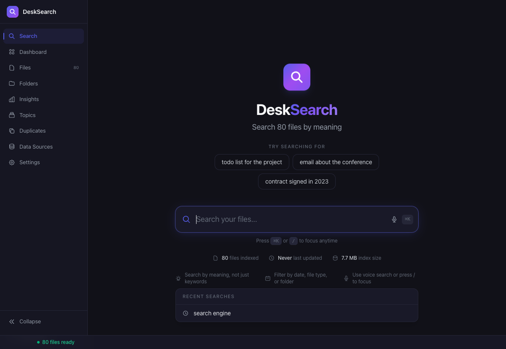
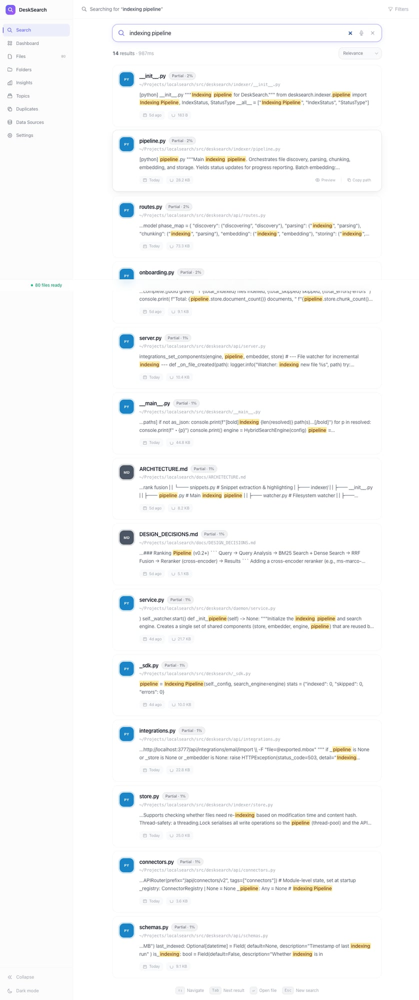
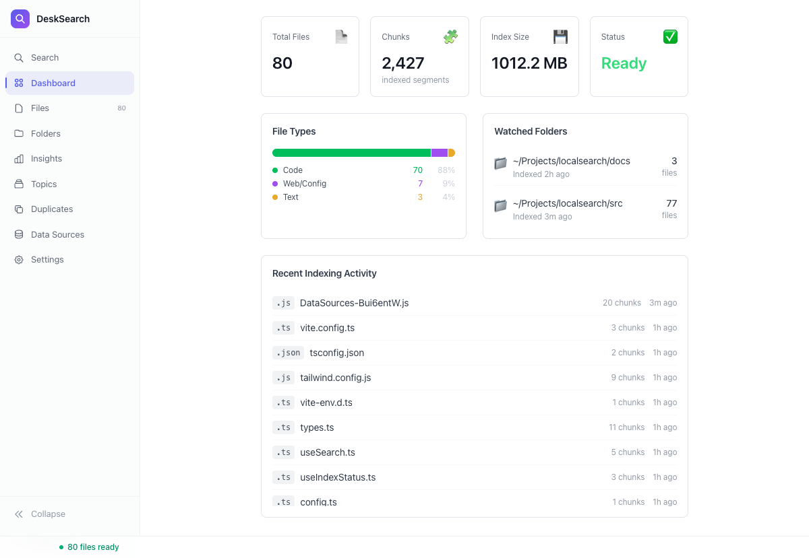
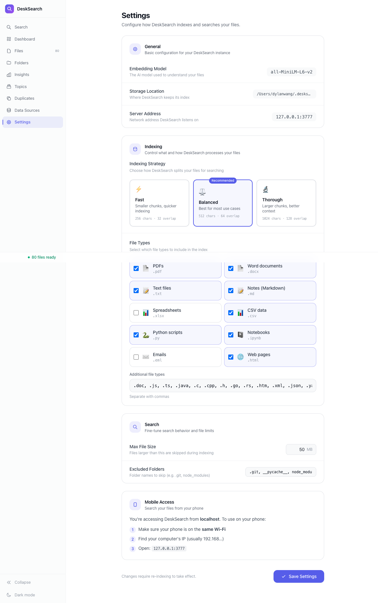
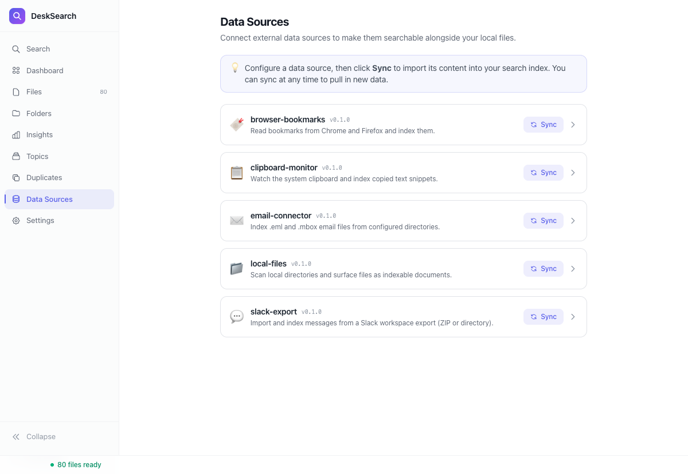
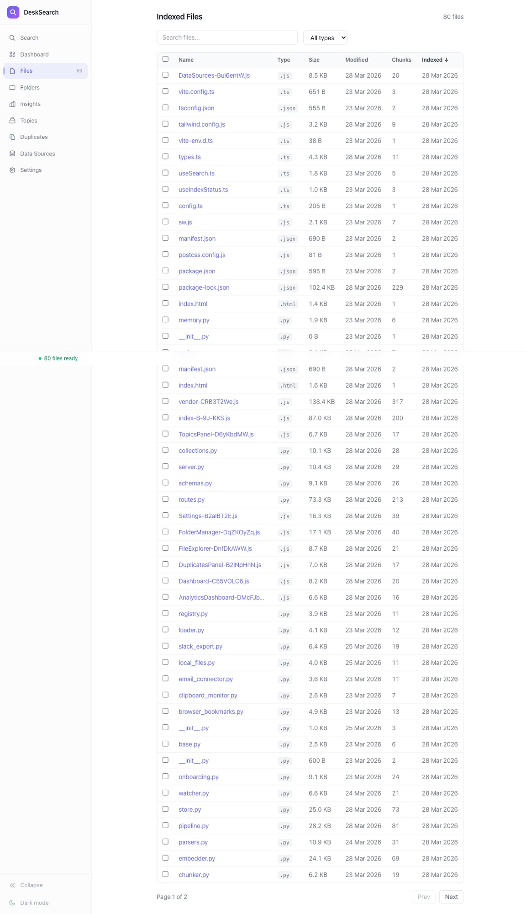

<p align="center">
  
</p>

<h1 align="center">DeskSearch</h1>

<p align="center">
  <strong>Search your files by meaning. Faster than Spotlight. 100% private.</strong>
</p>

<p align="center">
  <a href="https://pypi.org/project/desksearch/"></a>
  <a href="https://github.com/wshuai190/desksearch/releases"></a>
  <a href="https://github.com/wshuai190/desksearch/blob/main/LICENSE"></a>
  <a href="https://github.com/wshuai190/desksearch/actions"></a>
</p>

<p align="center">
  <code>0.83ms search</code> · <code>13MB binary</code> · <code>100% offline</code> · <code>50k+ files</code> · <code>10× ONNX speedup</code>
</p>

<p align="center">
  
</p>

---

DeskSearch is a local semantic search engine that understands what you're looking for — not just the words you type. Index your documents, code, and emails in seconds. Search in under a millisecond. Everything stays on your machine.

Available as a **Python package** (`pip install desksearch`) and a **standalone Rust binary** (13MB, zero dependencies).

<p align="center">
  
</p>

<p align="center">
  
</p>

<p align="center">
  
</p>

<details>
<summary><strong>More screenshots</strong></summary>

<p align="center">
  <strong>Settings — Speed Tiers & File Types</strong><br/>
  
</p>

<p align="center">
  <strong>Data Sources — Connectors</strong><br/>
  
</p>

<p align="center">
  <strong>File Explorer</strong><br/>
  
</p>

</details>

---

## Features

| | Feature | What it means |
|---|---|---|
| 🔍 | **Semantic search** | Finds "Q3 earnings" when you search "quarterly revenue" — understands meaning, not just keywords |
| ⚡ | **Sub-millisecond search** | 0.83ms p50 latency powered by Starbucks 2D Matryoshka embeddings |
| 🔒 | **100% private** | All processing runs locally. No cloud. No telemetry. No data ever leaves your machine |
| 📄 | **30+ file types** | PDF, DOCX, PPTX, XLSX, code (20+ languages), email, Jupyter notebooks, archives |
| 👁 | **Live reindexing** | Built-in file watcher auto-detects changes — your index is always current |
| 🎨 | **Beautiful web UI** | React frontend with dark mode, live search, file preview, and keyboard shortcuts |
| 🦀 | **Rust core** | 13MB self-contained binary with PDF/DOCX/PPTX/XLSX parsers, hybrid BM25+dense search, embedded frontend |
| ☕ | **3 speed tiers** | **Fast** (2-layer, 32d) · **Middle** (4-layer, 64d) · **Pro** (6-layer, 128d) — you pick the trade-off |
| 🔌 | **Connector plugins** | Local files, email (.eml/.mbox), Chrome bookmarks, Slack exports — extensible architecture |
| ⚙️ | **ONNX acceleration** | 10× embedding speedup (171 chunks/sec) with INT8 quantization support |
| 📊 | **Advanced filters** | Filter by file type, date range, size · Sort by relevance, date, size, name · Export as JSON/CSV/text |
| ⭐ | **Favorites & recents** | Bookmark important files and track recently opened documents |

---

## Quick Start

### Python

```bash
pip install desksearch
desksearch
# → opens http://localhost:3777
```

### Rust

```bash
curl -fsSL https://github.com/wshuai190/desksearch/releases/latest/download/desksearch -o desksearch
chmod +x desksearch
./desksearch
# → opens http://localhost:3777
```

On first run, DeskSearch walks you through an onboarding wizard to pick folders and a speed tier. After that, one command is all you need.

---

---

## CLI Examples

```bash
# Semantic search from the terminal
desksearch search "machine learning papers"
desksearch search "budget spreadsheet" --type xlsx --json

# Index specific folders
desksearch index ~/Projects ~/Research

# Check index health
desksearch status
desksearch doctor            # full health check

# Manage watched folders
desksearch folders add ~/Notes
desksearch folders list

# Switch speed tier
desksearch config set search_speed pro

# Run as a background daemon
desksearch daemon start
desksearch daemon install    # auto-start on login (macOS LaunchAgent)

# Benchmark your setup
desksearch benchmark --files 1000
```

All commands support `--json` for scripting and automation.

---

## DeskSearch vs. Alternatives

| | **DeskSearch** | Spotlight | Everything | Alfred |
|---|---|---|---|---|
| **Search type** | Semantic + keyword | Keyword | Filename only | Keyword |
| **Understands meaning** | ✅ Yes | ❌ | ❌ | ❌ |
| **File content search** | ✅ 30+ formats | Limited | ❌ | Via plugins |
| **Search latency** | **~1ms** | ~50ms | ~1ms | ~50ms |
| **Privacy** | 100% local | Local (Siri opt-in) | Local | Local |
| **Code-aware** | ✅ 20+ languages | Minimal | ❌ | ❌ |
| **Extensible** | Plugins + REST API | ❌ | ❌ | Workflows |
| **Open source** | ✅ MIT | ❌ | ❌ | ❌ |
| **Cross-platform** | macOS, Linux | macOS only | Windows only | macOS only |

---

## Powered by Starbucks Embeddings

DeskSearch uses the [Starbucks](https://huggingface.co/ielabgroup/Starbucks-msmarco) 2D Matryoshka embedding model, which enables flexible layer × dimension truncation for speed/quality trade-offs.

**Paper:** [Starbucks: Improved Training for 2D Matryoshka Embeddings](https://arxiv.org/abs/2410.13230)
*Shuai Wang, Shengyao Zhuang, Bevan Koopman, Guido Zuccon* — ECIR 2026

> Unlike traditional embeddings that require fixed dimensions, Starbucks lets you choose both the number of transformer layers AND the embedding dimension at inference time — no retraining needed. DeskSearch leverages this to offer three speed tiers from a single model.

If you use DeskSearch or the Starbucks model in your research, please cite:

```bibtex
@inproceedings{wang2026starbucks,
  title={Starbucks: Improved Training for 2D Matryoshka Embeddings},
  author={Wang, Shuai and Zhuang, Shengyao and Koopman, Bevan and Zuccon, Guido},
  booktitle={ECIR},
  year={2026}
}
```

---

## Architecture

DeskSearch runs **hybrid retrieval** — every query hits a [Tantivy](https://github.com/quickwit-oss/tantivy) BM25 index and a FAISS dense vector index in parallel, then merges results via Reciprocal Rank Fusion (RRF). Embeddings come from the Starbucks 2D Matryoshka model with layer and dimension truncation, running on ONNX Runtime for **10× speedup** over PyTorch (171 chunks/sec vs 17). The indexing pipeline parses files across 6 parallel workers, chunks at sentence boundaries, and embeds in batches of 256 for maximum throughput. A **connector plugin system** (v0.6.0) lets you pull in data from local files, email, Chrome bookmarks, and Slack exports via a unified API.

```
Your Files (PDF, DOCX, Markdown, Code, ...)
              │
              ▼  Parse → Chunk → Embed
   ┌──────────────────────────────────────┐
   │   30+ parsers → 512-char chunks      │
   │   → Starbucks 2D Matryoshka (ONNX)   │
   └───────────┬──────────────────────────┘
               │
       ┌───────┴────────┐
       ▼                ▼
  BM25 (Tantivy)   FAISS (dense)
  keyword index     semantic index
       │                │
       └───────┬────────┘
               ▼
    Reciprocal Rank Fusion
               │
               ▼
     Ranked Results + Snippets
```

---

## Connectors (v0.6.0)

DeskSearch supports pluggable data connectors to index content from multiple sources:

| Connector | What it does |
|---|---|
| **Local files** | File system scanning with scheduled sync and live re-indexing |
| **Email** | Parse `.eml` and `.mbox` files with sender, subject, and date extraction |
| **Chrome bookmarks** | Read your Chrome profile's bookmark hierarchy |
| **Slack export** | Import Slack ZIP exports with username resolution |

Manage connectors via the API (`/api/connectors/v2/`) or the web UI settings panel. The `ConnectorRegistry` handles discovery, configuration, and sync scheduling.

---

## Speed Tiers

| Tier | Layers | Dimensions | Best for |
|---|---|---|---|
| `fast` | 2 | 32 | Large corpora, older hardware |
| `middle` | 4 | 64 | **Default** — balanced speed and quality |
| `pro` | 6 | 128 | Best accuracy, research use |

```bash
desksearch config set search_speed pro
```

---

## API

DeskSearch exposes a REST API on `localhost:3777`:

```bash
curl "http://localhost:3777/api/search?q=quarterly+revenue&limit=5"
curl "http://localhost:3777/api/status"
curl "http://localhost:3777/api/health"
```

### Python SDK

```python
from desksearch import DeskSearch

with DeskSearch() as ds:
    results = ds.search("quarterly revenue", limit=5)
    for r in results:
        print(f"{r.rank}. {r.filename} ({r.score:.3f})")
        print(f"   {r.snippet}\n")
```

---

## Contributing

Contributions welcome. DeskSearch is MIT-licensed.

```bash
git clone https://github.com/wshuai190/desksearch.git
cd desksearch
pip install -e ".[dev]"
pytest
```

---

## License

[MIT](LICENSE) © [Shuai Wang](https://wshuai190.github.io/)
